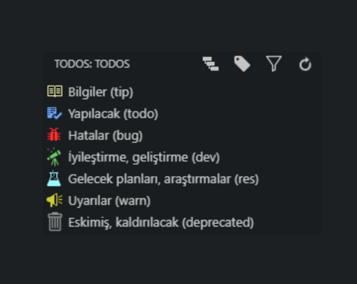

# YReact-Firebase <!-- omit in toc -->

React ⚛️, React-Router 🔗 ve Firebase 🔥 projesi ([canlı 🌍](https://yreact-firebase.firebaseapp.com/))

> Son tamamlanan kurs: [A Firebase in React Tutorial for Beginners [2019]](https://www.robinwieruch.de/complete-firebase-authentication-react-tutorial/)

## İçerikler <!-- omit in toc -->

- [Açıklama](#A%C3%A7%C4%B1klama)
- [Projenin Temel İlerleyişi](#Projenin-Temel-%C4%B0lerleyi%C5%9Fi)
  - [A Firebase in React Tutorial for Beginners](#A-Firebase-in-React-Tutorial-for-Beginners)
- [Ek Notlar](#Ek-Notlar)
  - [Çalıştırıldığında boş sayfa gözükmesi](#%C3%87al%C4%B1%C5%9Ft%C4%B1r%C4%B1ld%C4%B1%C4%9F%C4%B1nda-bo%C5%9F-sayfa-g%C3%B6z%C3%BCkmesi)
  - [TODO-Tree Yapılandırması](#TODO-Tree-Yap%C4%B1land%C4%B1rmas%C4%B1)
- [Destek ve İletişim](#Destek-ve-%C4%B0leti%C5%9Fim)

## Açıklama

- Kişisel notlarım [Kişisel Notlar 📔](Ki%C5%9Fisel%20Notlar) dizinindedir
- Faydalı kitaplar [Kitaplar 📚](Kitaplar) dizinindedir.
- Faydalı kaynaklar listem için [buraya 🌟](Kişisel%20Notlar/X%20-%20Faydalı%20Kaynaklar.md) bakabilirsin.

> Data Science notlarım için [YDataScience 📊](https://github.com/yedhrab/YDataScience) _repository_'isine bakabilirsin.

## Projenin Temel İlerleyişi

Her yeni fonksiyon için **commit** yapılmıştır, commitler üzerinden takip edebilirsin.

### A Firebase in React Tutorial for Beginners

Kursun sitesi için [buraya](https://www.robinwieruch.de/complete-firebase-authentication-react-tutorial/) bakabilirsin.

- React ve React router temelleri atıldı ⚛
- Temel navigasyon yapısı oluşturuldu 🧭
- Firebase 🔥 bağlantısı kuruldu
- Firebase 🔥 bağlantısı ve auth işlemleri oluşturuldu
- Giriş yapıldığında sayfa yönlendirmesi ↗
- Recompose yapısı eklendi 🕯
- Giriş yapma fonksiyonu eklendi 🎟
- Çıkış yapma fonksiyonu eklendi 🚶‍♂️
- Firebase 🔥 üzerinde oturuma göre işlemler
- React Context API ⚛ ile daha temiz yapı oluşturuldu ✨
- Şifre sıfırlama alanı eklendi 🔐
- Şifre değiştirme alanı eklendi 🔐
- Koşullu sayfa yönlendirme eklendi 🔐
- Database 📂 temelleri atıldı
- Kullanıcı kayıtları database'e de eklenmekte 📅
- Admin 👨 sayfası eklendi
- Kurs tamamlandı 🚀

## Ek Notlar

### Çalıştırıldığında boş sayfa gözükmesi

- `.env` dosyanızı koyamazsanız firebase'e bağlanılamayacağından boş sayfa gözükecektir

### TODO-Tree Yapılandırması



<details>
<summary>Yapılandırmayı göster</summary>

```json
{
  "todo-tree.tags": ["TODO:", "BUG:", "DEV:", "RES:", "OLD:", "WARN:", "TIP:"],
  "todo-tree.labelFormat": "${after}", // (${line})
  "todo-tree.tagsOnly": true,
  "todo-tree.defaultHighlight": {
    "icon": "tasklist",
    "type": "text",
    "background": "#6FA5FF",
    "opacity": 17,
    "iconColour": "#6FA5FF"
  },
  "todo-tree.customHighlight": {
    "TIP:": {
      "icon": "book",
      "type": "text",
      "foreground": "#f5f2a9",
      "background": "#f5f2a9",
      "opacity": 7,
      "iconColour": "#f5f2a9"
    },
    "TODO:": {
      "icon": "checklist",
      "type": "text",
      "fontStyle": "normal",
      "foreground": "#6FA5FF",
      "background": "#6FA5FF",
      "opacity": 7,
      "iconColour": "#6FA5FF"
    },
    "BUG:": {
      "icon": "bug",
      "type": "text",
      "foreground": "#FF2C2C",
      "background": "#FF2C2C",
      "opacity": 7,
      "iconColour": "#FF2C2C"
    },
    "DEV:": {
      "icon": "telescope",
      "type": "text",
      "foreground": "#72CB6A",
      "background": "#72CB6A",
      "opacity": 7,
      "iconColour": "#72CB6A"
    },
    "RES:": {
      "icon": "beaker",
      "type": "text",
      "foreground": "#9CF7FF",
      "background": "#9CF7FF",
      "opacity": 7,
      "iconColour": "#9CF7FF"
    },
    "WARN:": {
      "icon": "megaphone",
      "type": "text",
      "foreground": "#CFCC35",
      "background": "#CFCC35",
      "opacity": 7,
      "iconColour": "#CFCC35"
    },
    "OLD:": {
      "icon": "trashcan",
      "type": "text",
      "foreground": "#959595",
      "background": "#959595",
      "opacity": 7,
      "iconColour": "#959595"
    }
  }
}
```

</details>

## Destek ve İletişim

**The [MIT License](https://choosealicense.com/licenses/mit/) &copy; Yunus Emre Ak**

[][github]
[][linkedin]
[][website]
[][mail]
[][bağış anlık]

[][bağış aylık]

<!-- İletişim -->

[mail]: mailto::yedhrab@gmail.com?subject=YBilgiler%20%7C%20Github
[github]: https://github.com/yedhrab
[website]: https://yemreak.com
[linkedin]: https://www.linkedin.com/in/yemreak/
[bağış anlık]: https://gogetfunding.com/yemreak/
[bağış aylık]: https://www.patreon.com/yemreak/

<!-- İletişim Sonu -->
